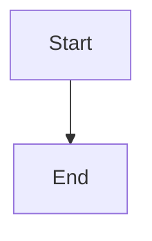

# MD-PDF Exporter

A VS Code / Cursor extension that exports Markdown files to PDF. **Mermaid diagrams and flowcharts** (including those created in Cursor) are rendered as images in the exported PDF, not as raw code blocks.

## Features

- Export the active `.md` file to PDF from the editor or file explorer
- Render ` ```mermaid ` code blocks as diagrams in the PDF
- Embed local images referenced in Markdown (``)
- Syntax-highlighted code blocks
- GitHub-flavored Markdown styling
- Works in **VS Code** and **Cursor**

## Requirements

- **Google Chrome** or **Microsoft Edge** installed locally (used for PDF generation)
- If auto-detection fails, set `pdfexporter.executablePath` in settings

## Install in Cursor / VS Code

### From source (development)

1. Clone this repository
2. Install dependencies and build:

   ```bash
   npm install
   npm run build
   ```

3. Press `F5` in VS Code/Cursor to launch an Extension Development Host
4. Open a `.md` file and run **Markdown PDF Exporter: Export to PDF**

### Package as VSIX

```bash
npm install
npm run build
npm run package
```

Then install the generated `.vsix` file:

- Cursor: Extensions panel → `...` → **Install from VSIX...**
- VS Code: same flow in the Extensions view

## Usage

1. Open a Markdown file
2. Run one of:
   - Command Palette → `Markdown PDF Exporter: Export to PDF`
   - Right-click in the editor → **Markdown PDF Exporter: Export to PDF**
   - Right-click a `.md` file in the explorer → **Markdown PDF Exporter: Export to PDF**
   - Shortcut: `Ctrl+Shift+E` (Mac: `Cmd+Shift+E`) while editing Markdown

The PDF is saved next to the Markdown file by default.

## Mermaid / Cursor diagrams

Cursor stores diagrams in standard Mermaid fenced code blocks:

````markdown

````

The extension renders these locally before PDF export—no external diagram server required.

## Settings

| Setting | Default | Description |
| --- | --- | --- |
| `pdfexporter.outputDirectory` | `""` | Output folder. Empty = same folder as the `.md` file |
| `pdfexporter.executablePath` | `""` | Path to Chrome/Edge. Auto-detected when empty |
| `pdfexporter.pageFormat` | `A4` | Page size: A4, Letter, Legal, Tabloid |
| `pdfexporter.renderMermaid` | `true` | Render Mermaid diagrams in PDF |
| `pdfexporter.mermaidTheme` | `default` | Mermaid theme: default, dark, forest, neutral |
| `pdfexporter.exportTimeout` | `60000` | Max wait time (ms) for diagram rendering |

## Example

See [`examples/sample.md`](examples/sample.md) for a document with Mermaid flowcharts and sequence diagrams.

## Support

See [support.md](support.md) for troubleshooting, requirements, and how to report issues.

## License

MIT
