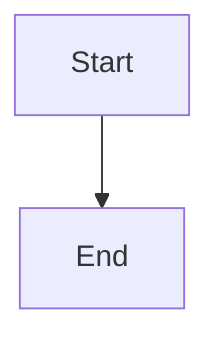

# MD-PDF Exporter

A VS Code / Cursor extension that exports Markdown files to PDF. **Mermaid diagrams and flowcharts** (including those created in Cursor) are rendered as images in the exported PDF, not as raw code blocks.

## Features

- Export the active `.md` file to PDF from the editor or file explorer
- **Export folder** — batch-export all Markdown files in a folder (right-click folder in Explorer)
- **YAML front matter** — per-document title, author, date, logo, margins, and PDF options
- **Headers, footers, and page numbers** in exported PDFs
- **MD Preview** webview panel (right-click submenu)
- Render ` ```mermaid ` code blocks as diagrams in the PDF
- Embed local images referenced in Markdown (``)
- Syntax-highlighted code blocks
- GitHub-flavored Markdown styling
- Opens the PDF in your **system viewer** after export (avoids built-in PDF extension issues)
- Works in **VS Code** and **Cursor**

## Requirements

- **Google Chrome** or **Microsoft Edge** installed locally (used for PDF generation)
- If auto-detection fails, set `pdfexporter.executablePath` in settings

## Install in Cursor / VS Code

### From source (development)

1. Clone this repository
2. Install dependencies and build:

   ```bash
   npm install
   npm run build
   ```

3. Press `F5` in VS Code/Cursor to launch an Extension Development Host
4. Open a `.md` file and run **Markdown PDF Exporter: Export to PDF**

### Package as VSIX

```bash
npm install
npm run build
npm run package
```

Then install the generated `.vsix` file:

- Cursor: Extensions panel → `...` → **Install from VSIX...**
- VS Code: same flow in the Extensions view

## Usage

### Export a single file

1. Open a Markdown file
2. Run one of:
   - Command Palette → `MD-PDF Exporter: Export to PDF`
   - Right-click in the editor → **MD-PDF Exporter** → **Export to PDF**
   - Right-click a `.md` file in the explorer → **MD-PDF Exporter** → **Export to PDF**
   - Shortcut: `Ctrl+Shift+E` (Mac: `Cmd+Shift+E`) while editing Markdown

The PDF is saved next to the Markdown file by default and opens in your system PDF viewer.

### MD Preview

- Right-click in the editor → **MD-PDF Exporter** → **MD Preview**
- Or `Ctrl+Shift+M` (Mac: `Cmd+Shift+M`)

### Export a folder

1. Right-click a folder in the Explorer → **Export Folder to PDF**
2. All `.md` / `.markdown` files in that folder are exported (enable `pdfexporter.batchRecursive` to include subfolders)

### Front matter (per-document options)

Add YAML at the top of a `.md` file to override settings for that export:

```yaml
---
title: Document title
author: Author name
date: 2026-06-15
pdf:
  showLogo: true
  logo: ./path/to/logo.png
  showPageNumbers: true
  header: Custom header text
  footer: Custom footer text
  outputDirectory: ./output
  pageFormat: A4
---
```

See [`examples/front-matter-sample.md`](examples/front-matter-sample.md).

## Mermaid / Cursor diagrams

Cursor stores diagrams in standard Mermaid fenced code blocks:

````markdown

```mermaid
flowchart TD
    A[Start] --> B[End]
```
````

The extension renders these locally before PDF export—no external diagram server required.

## Settings

| Setting | Default | Description |
| --- | --- | --- |
| `pdfexporter.outputDirectory` | `""` | Output folder. Empty = same folder as the `.md` file |
| `pdfexporter.executablePath` | `""` | Path to Chrome/Edge. Auto-detected when empty |
| `pdfexporter.pageFormat` | `A4` | Page size: A4, Letter, Legal, Tabloid |
| `pdfexporter.renderMermaid` | `true` | Render Mermaid diagrams in PDF |
| `pdfexporter.mermaidTheme` | `default` | Mermaid theme: default, dark, forest, neutral |
| `pdfexporter.showLogo` | `true` | Logo at the top of exported PDFs |
| `pdfexporter.headerFooter.enabled` | `true` | Header and footer in exported PDFs |
| `pdfexporter.headerFooter.showPageNumbers` | `true` | Page numbers in the PDF footer |
| `pdfexporter.batchRecursive` | `false` | Include subfolders when exporting a folder |
| `pdfexporter.exportTimeout` | `60000` | Max wait time (ms) for diagram rendering |

## Example

- [`examples/sample.md`](examples/sample.md) — Mermaid flowcharts and sequence diagrams
- [`examples/front-matter-sample.md`](examples/front-matter-sample.md) — YAML front matter, headers, and page numbers

## Support

See [support.md](support.md) for troubleshooting, requirements, and how to report issues.

## License

MIT
