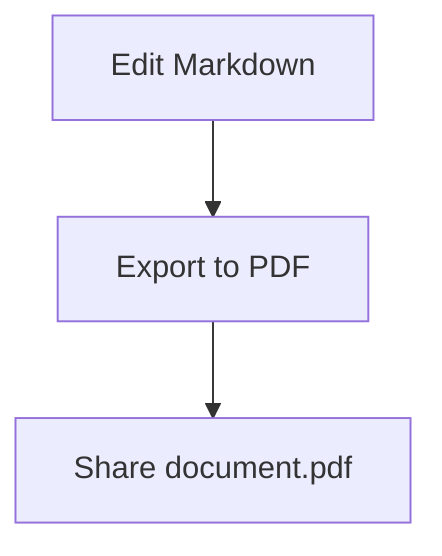

# MD-PDF Exporter

**Export Markdown to polished PDFs — with Mermaid diagrams, images, headers, and page numbers.**

Works in **VS Code** and **Cursor**. Everything runs locally on your machine; nothing is uploaded to the cloud.

[](https://github.com/ramdeoangh/pdfexporter/releases)
[](LICENSE)
[](https://marketplace.visualstudio.com/items?itemName=ramdeoangh.pdfexporter)

---

## Install

### Option 1 — VS Code Marketplace (recommended)

1. Open **Extensions** (`Ctrl+Shift+X` / `Cmd+Shift+X`)
2. Search for **MD-PDF Exporter**
3. Click **Install**

Or install from the web: [marketplace.visualstudio.com/items?itemName=ramdeoangh.pdfexporter](https://marketplace.visualstudio.com/items?itemName=ramdeoangh.pdfexporter)

### Option 2 — Download VSIX (Cursor or offline)

1. Download the latest `.vsix` from [GitHub Releases](https://github.com/ramdeoangh/pdfexporter/releases)
2. In Cursor or VS Code: **Extensions** → `...` menu → **Install from VSIX…**
3. Select the downloaded file
4. Run **Developer: Reload Window** from the Command Palette

```bash
# Or install from the command line (Cursor)
cursor --install-extension pdfexporter-0.2.1.vsix
```

### Option 3 — Build from source

```bash
git clone https://github.com/ramdeoangh/pdfexporter.git
cd pdfexporter
npm install
npm run build
npm run package
```

Install the generated `package/pdfexporter-*.vsix` as above, or press `F5` to run in an Extension Development Host.

### Requirements

| | |
| --- | --- |
| **Browser** | Google Chrome or Microsoft Edge (for PDF rendering) |
| **Editor** | VS Code or Cursor `1.85.0+` |
| **Windows tip** | Keep `node` on your PATH for reliable exports |

If the browser is not auto-detected, set `pdfexporter.executablePath` in Settings.

---

## Quick start

**Export a single file**

1. Open any `.md` file
2. Right-click → **MD-PDF Exporter** → **Export to PDF**
3. Your PDF opens in the system viewer next to the Markdown file

| Action | Shortcut |
| --- | --- |
| Export to PDF | `Ctrl+Shift+E` (`Cmd+Shift+E` on Mac) |
| MD Preview | `Ctrl+Shift+M` (`Cmd+Shift+M` on Mac) |

**Export a whole folder** — right-click a folder in the Explorer → **Export Folder to PDF**

**Per-document options** — add YAML front matter at the top of your `.md` file (see [examples/front-matter-sample.md](examples/front-matter-sample.md))

---

## Why use this?

| Feature | What you get |
| --- | --- |
| **Mermaid & diagrams** | ` ```mermaid ` blocks render as real diagrams in the PDF |
| **Local images** | `` embedded from your project |
| **MD Preview** | Live preview panel before you export |
| **Front matter** | Title, author, date, logo, margins per document |
| **Headers & footers** | Custom text and page numbers on every page |
| **Batch export** | Export every `.md` file in a folder at once |
| **Private by design** | Local browser only — no document upload |

---

## Front matter example

```yaml
---
title: Architecture Review
author: Jane Doe
date: 2026-06-15
pdf:
  showLogo: true
  logo: ./assets/logo.png
  header: "CONFIDENTIAL"
  footer: "Acme Corp"
  showPageNumbers: true
  pageFormat: A4
---
```

---

## Mermaid in Cursor

Cursor diagrams use standard Mermaid fenced blocks — no extra setup:

````markdown

```mermaid
flowchart TD
    A[Edit Markdown] --> B[Export to PDF]
    B --> C[Share document.pdf]
```
````

---

## Settings

| Setting | Default | Description |
| --- | --- | --- |
| `pdfexporter.outputDirectory` | `""` | Output folder (empty = same folder as the `.md` file) |
| `pdfexporter.executablePath` | `""` | Path to Chrome/Edge |
| `pdfexporter.pageFormat` | `A4` | A4, Letter, Legal, Tabloid |
| `pdfexporter.renderMermaid` | `true` | Render Mermaid diagrams |
| `pdfexporter.mermaidTheme` | `default` | default, dark, forest, neutral |
| `pdfexporter.showLogo` | `true` | “Powered by MD-PDF Exporter” branding at end of PDF |
| `pdfexporter.headerFooter.enabled` | `true` | Header and footer in PDFs |
| `pdfexporter.headerFooter.showPageNumbers` | `true` | Page numbers in the footer |
| `pdfexporter.batchRecursive` | `false` | Include subfolders when exporting a folder |
| `pdfexporter.exportTimeout` | `60000` | Max wait (ms) for diagram rendering |

---

## Examples

- [examples/sample.md](examples/sample.md) — flowcharts, sequence diagrams, tables
- [examples/front-matter-sample.md](examples/front-matter-sample.md) — front matter, headers, page numbers

---

## Support

- [support.md](support.md) — troubleshooting and FAQ
- [GitHub Issues](https://github.com/ramdeoangh/pdfexporter/issues) — bugs and feature requests

---

## License

MIT — see [LICENSE](LICENSE).
