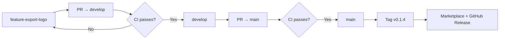

# Release pipeline (GitHub → Marketplace)

Branching model for **MD-PDF Exporter**: `develop` for daily work, `main` for releases.

---

## Branch model

```text
develop (default)  ← integration / active development
main               ← production releases only
feature-<name>     ← short-lived feature branches
```



| Branch | Purpose | Merges from |
| --- | --- | --- |
| **`develop`** | Default branch, ongoing development | `feature-<name>` via PR |
| **`main`** | Release-ready code only | `develop` via PR |
| **`feature-<name>`** | One feature or fix | — (deleted after merge) |

**Examples:** `feature-right-click-menu`, `feature-mermaid-theme`, `feature-pdf-logo`

---

## Pipelines

| Workflow | Trigger | Action |
| --- | --- | --- |
| **CI** | PR or push to `develop` or `main` | Lint, build, package VSIX (artifact) |
| **Release** | Push tag `v*` on `main` | Publish to Marketplace + GitHub Release |

Tags are created **only on `main`** after a release PR is merged.

---

## Day-to-day development

### 1. Start from `develop`

```bash
git checkout develop
git pull origin develop
git checkout -b feature-right-click-menu
```

### 2. Work, commit, push

```bash
git add .
git commit -m "feat: add right-click export menu"
git push -u origin feature-right-click-menu
```

### 3. Open PR → `develop`

- Base: **`develop`**
- Compare: **`feature-right-click-menu`**
- Wait for **CI** to pass
- Merge PR

### 4. Delete feature branch (optional)

```bash
git branch -d feature-right-click-menu
git push origin --delete feature-right-click-menu
```

---

## Release to Marketplace

When `develop` is ready for a public release:

### 1. Open PR `develop` → `main`

- Base: **`main`**
- Compare: **`develop`**
- In this PR (or on `main` after merge), bump **`version`** in `package.json`
- Wait for **CI** to pass
- Merge PR

### 2. Tag on `main`

Tag must match `package.json` (with `v` prefix):

```bash
git checkout main
git pull origin main
git tag v0.1.4
git push origin v0.1.4
```

### 3. Automated publish

**Release** workflow (`.github/workflows/release.yml`):

1. Verifies tag matches `package.json`
2. Publishes to **VS Code Marketplace** (`ramdeoangh.pdfexporter`)
3. Creates **GitHub Release** with VSIX attached

### 4. Sync `develop` with `main` (if needed)

After release, merge `main` back into `develop` if versions diverged:

```bash
git checkout develop
git pull origin develop
git merge main
git push origin develop
```

---

## GitHub repository settings

### Default branch

**Settings → General → Default branch** → set to **`develop`**

### Branch protection

**`develop`** (recommended):

- Require pull request before merging
- Require CI status check: **build**

**`main`** (recommended):

- Require pull request before merging
- Require CI status check: **build**
- Restrict who can push (optional)
- Only allow merges from `develop` via PR (no direct commits)

### Secrets

**Settings → Secrets and variables → Actions**:

| Secret | Purpose |
| --- | --- |
| `VSCE_PAT` | Azure DevOps PAT with **Marketplace → Manage** |

---

## Versioning

Use [Semantic Versioning](https://semver.org/):

| Change | Example |
| --- | --- |
| Patch | `0.1.3` → `0.1.4` |
| Minor | `0.1.4` → `0.2.0` |
| Major | `0.2.0` → `1.0.0` |

Bump version in the **`develop` → `main`** release PR. Tag format: `v0.1.4`.

---

## Why this model?

| Question | Answer |
| --- | --- |
| Why `develop` as default? | Safe place for features; `main` stays release-quality |
| Why PR to `main` for release? | Review + CI before anything goes to production |
| Why tags on `main`? | Marketplace publish only when you explicitly release |
| Feature branch naming? | `feature-<short-description>` (e.g. `feature-pdf-logo`) |

---

## One-time setup checklist

- [ ] Push `develop` branch to GitHub
- [ ] Set **default branch** to `develop`
- [ ] Enable branch protection on `develop` and `main`
- [ ] Add `VSCE_PAT` secret
- [ ] Create publisher `ramdeoangh` on Marketplace

---

## Quick reference

```bash
# New feature
git checkout develop && git pull
git checkout -b feature-my-change
# ... commit ...
git push -u origin feature-my-change
# → PR to develop → merge

# Release
# → PR develop to main (bump package.json version) → merge
git checkout main && git pull
git tag v0.1.4 && git push origin v0.1.4
# → Marketplace publish runs automatically
```

---

## Workflow files

| File | Purpose |
| --- | --- |
| `.github/workflows/ci.yml` | Build on PR/push to `develop` and `main` |
| `.github/workflows/release.yml` | Publish on tag `v*` |
| `docs/publish.md` | Manual publish fallback |
