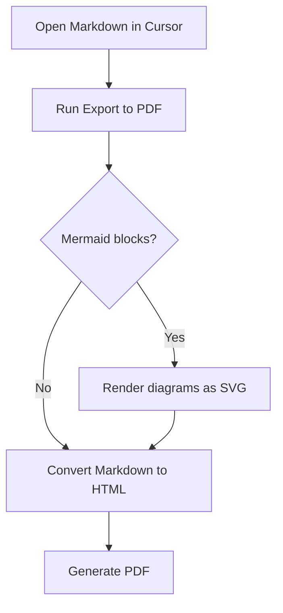
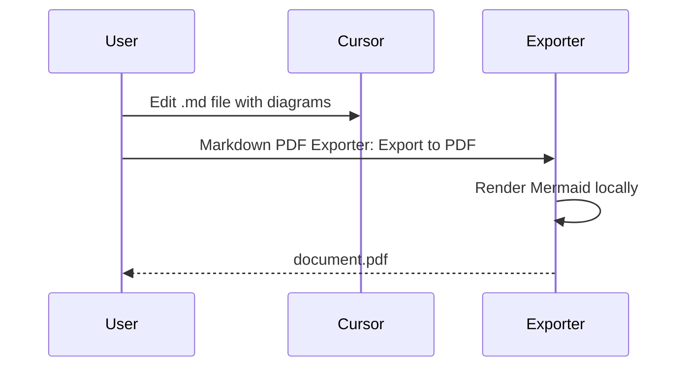

# Sample Export

This document demonstrates Markdown PDF Exporter with diagrams and images.

## Flowchart



## Sequence diagram



## Code block

```typescript
export async function exportMarkdownToPdf(path: string): Promise<string> {
  return path.replace(/\.md$/, ".pdf");
}
```

## Table

| Feature | Supported |
| --- | --- |
| Mermaid flowcharts | Yes |
| Local images | Yes |
| Syntax highlighting | Yes |
